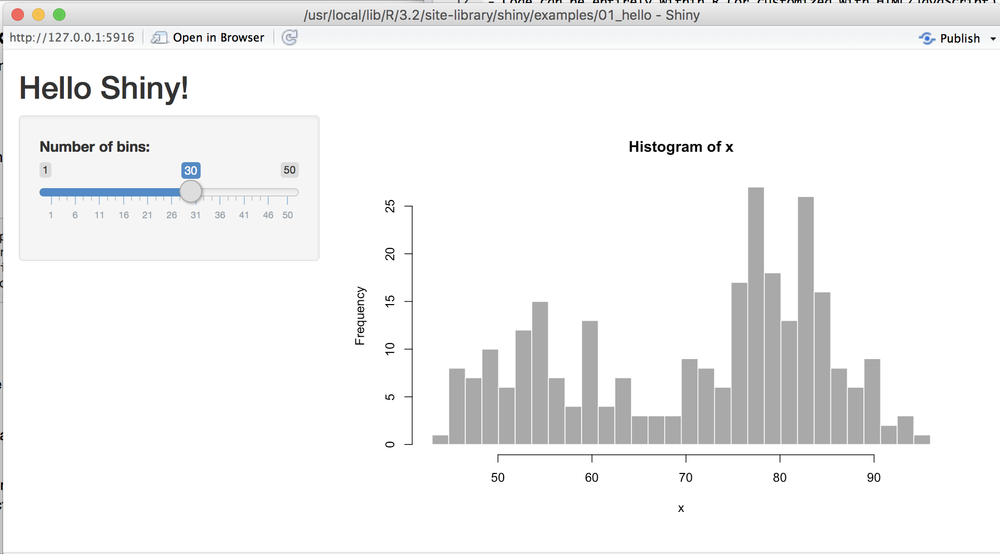

## First Things First

- Slides are available at http://www.erichare.me/shiny-presentation
- Let's go to GitHub and download some files: http://www.github.com/erichare/shiny-presentation

## What is Shiny?

**Shiny** is an R package that allows you to easily create interactive web applets using R. 

- Produced by [RStudio](http://shiny.rstudio.com)
- Code can be entirely within R (or customized with HTML/JavaScript)
- Take a look at RStudio's [showcase](http://shiny.rstudio.com/gallery/) of Shiny applets
- [RStudio Tutorial](http://shiny.rstudio.com/tutorial/)  
Much of tonight's material is motivated by this tutorial
- [Shiny Setup, Showcase, and Server setup](http://shiny.rstudio.com)  
Useful if you want to use shiny on your own webserver

## Installing Shiny

Run this code in RStudio:

```{r, eval=FALSE}
install.packages("shiny")
```  

## A Simple Example

```{r, eval=FALSE}
library(shiny)
runApp("hello_world")
```
<center>

</center>

## Let's see some more complex Shiny apps

Volunteers!

## A Tale of Two Files

The quickest/easiest way to create a shiny app is to define the user interface in a file named **ui.R** and the server side functionality in **server.R**.

- **ui.R** defines the page layout and user interface
- **server.R** contains the R code to create any output

## ui.R

```{r, eval=FALSE}
library(shiny)

# A simple/common user interface template
shinyUI(fluidPage(

  # Application title
  titlePanel("Title"),
  
  sidebarPanel(
    # Define some inputs here
  ),
  
  mainPanel(
    # output (from the server) go here
  )

))
```

## server.R

```{r, eval=FALSE}
library(shiny)

# Server side logic 
shinyServer(function(input, output) {
  # do something
})
```

## Let's look at the hello world app

Can we add a new option to change the color of the bars?

http://shiny.rstudio.com/gallery/widget-gallery.html

## List of Inputs

- `checkboxGroupInput` - A group of check boxes
- `checkboxInput` -	A single check box
- `dateInput` -	A calendar to aid date selection
- `numericInput` - A field to enter numbers
- `radioButtons` -A set of radio buttons
- `selectInput` - A box with choices to select from
- `sliderInput` - A slider bar
- `textInput` - A field to enter text

## List of Outputs

- `renderImage` -	images (saved as a link to a source file)
- `renderPlot` -	plots
- `renderPrint` -	any printed output
- `renderTable` -	data frame, matrix, other table like structures
- `renderText` -	character strings
- `renderUI` - a Shiny tag object or HTML

## Widget Gallery

http://shiny.rstudio.com/gallery/widget-gallery.html

## Challenge #1:

- Add an option that allows the user to specify the **border color**
- (More Challenging) Allow the user to **choose a dataset**.
- (More Challenging) Add a new **table output** which will display the the **first n rows of the dataset selected**. The number of rows should be specified as an input.
